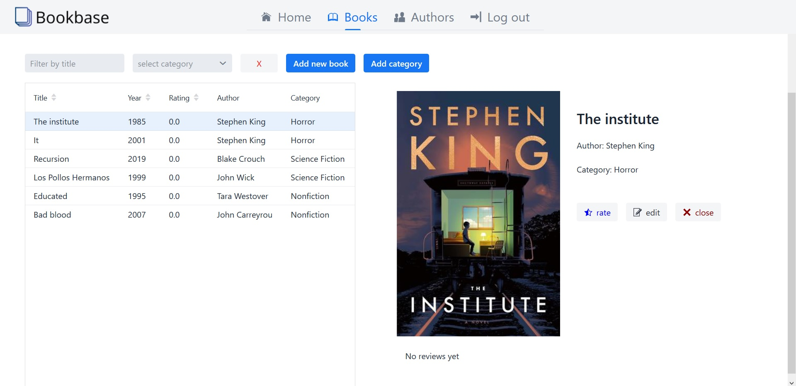
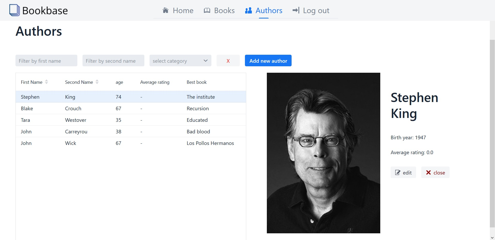
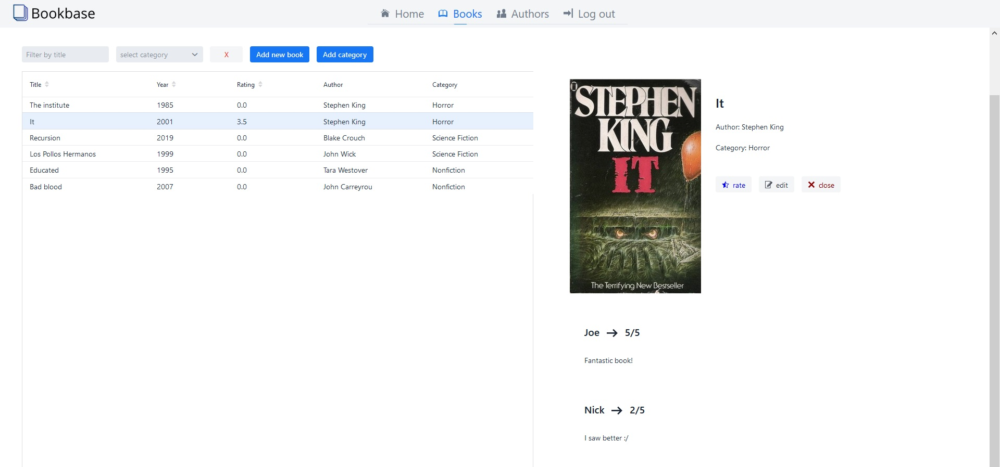

# bookbase
[**Bookbase**](http://bookbase3-env.eba-tbefkzvk.eu-central-1.elasticbeanstalk.com)
is a web application created with **Spring Boot** and **Vaadin** framework.

Project was developed by:
- [Tomasz Kozyra](https://github.com/tkozyra),
- [Kacper Rosiak](https://github.com/rosKacper),
- [Wojciech Ankus](https://github.com/vojteq)

## Table of Contents

- [About project](#about-project)
- [Technologies](#technologies)
- [Project overview](#project-overview)

## About project

To gain access to application, you have to log in with given credentials:
- username: user
- password: ala123

In app you can display all authors or books and rate them. Items can be **sorted** and **filtered**:
- alphabetically
- by date
- by category
- by rating

There are also forms to **add/edit** books, authors or categories.

After selecting item you can preview its details. If selected item is book, you can rate it.
 
 
## Technologies

  - Java 14
  - Spring Boot version 2.2.0
  - Vaadin framework

## Project overview

Books view in application:

 

Authors view in application:

 

Books view with displayed ratings and reviews:

 